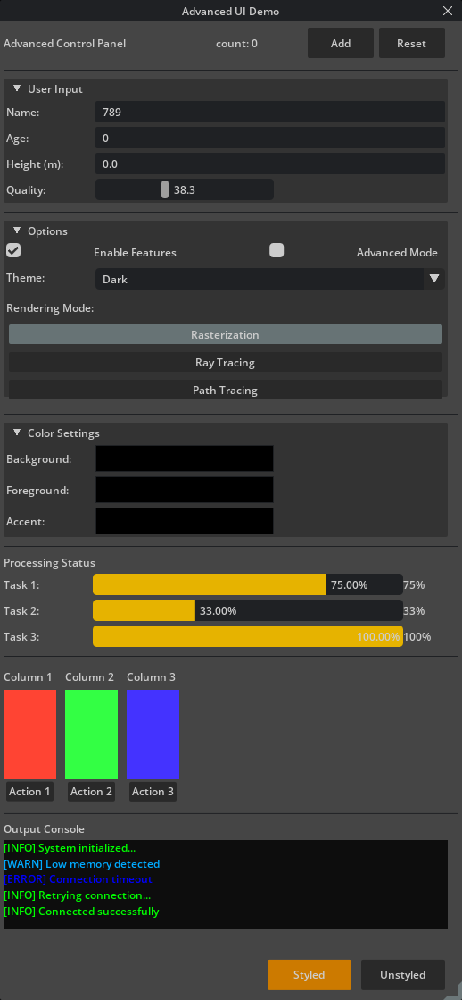

# DOM-based UI Builder for NVIDIA Omniverse Kit Extensions

Build omni.ui interfaces declaratively using XML or JSON instead of imperative Python code.



## Features

- **Declarative UI**: Separate UI structure from application logic
- **XML & JSON support**: Choose your preferred format
- **1:1 Mapping**: XML elements map directly to omni.ui widgets
- **Automatic type conversion**: Intelligent attribute type inference
- **Clean callback system**: Simple event handler registration
- **Named element access**: Syntactic sugar for accessing UI components

## Quick Start

### 1. Create your UI in XML

```xml
<?xml version="1.0" encoding="utf-8"?>
<Window xmlns:x="http://schemas.ui/name"
        x:Name="self._window"
        title="My Extension"
        width="300"
        height="200">
    <VStack spacing="10">
        <Label x:Name="label" text="Count: 0" />
        <HStack>
            <Button text="Increment" clicked_fn="on_increment" />
            <Button text="Reset" clicked_fn="on_reset" />
        </HStack>
    </VStack>
</Window>
```

### 2. Create your Python extension

```python
import os
from typing import Any
from .domextension import DomExtension

class MyExtension(DomExtension):
    def on_startup(self, ext_id: str):
        super().on_startup(ext_id)
        self._count = 0

        # Load UI from XML file
        ui_file = os.path.join(os.path.dirname(__file__), "my_ui.xml")
        self.load_ui(ui_file)

    def on_increment(self):
        self._count += 1
        self._named_elements.label.text = f"Count: {self._count}"

    def on_reset(self):
        self._count = 0
        self._named_elements.label.text = "Count: 0"
```

That's it! Your UI will be automatically constructed when the extension starts.

## Core Concepts

### 1:1 Mapping Philosophy

This extension follows a simple principle: **XML elements map directly to omni.ui widgets** without extensive validation or transformation. This means:

- `<Button text="Click Me" />` → `ui.Button("Click Me")`
- `<VStack spacing="10">` → `ui.VStack(spacing=10)`
- Widget attributes become constructor parameters
- No magic, no surprises

### Python Inheritance Pattern

Your extension class inherits from `DomExtension`:

```python
class MyExtension(DomExtension):
    def on_startup(self, ext_id: str):
        super().on_startup(ext_id)  # Initialize base class
        self.load_ui("path/to/ui.xml")  # Load your UI

    # Define callbacks referenced in XML
    def on_click(self):
        pass
```

The base class handles:
- XML/JSON parsing
- Widget creation
- Callback registration
- Named element storage

### Named Elements Access

Instead of using a plain dictionary, we use an `ElementAccessor` class that provides cleaner syntax:

```python
# Access named elements using dot notation
self._named_elements.label.text = "New text"
self._named_elements.button.enabled = False

# Much cleaner than dictionary access
# self._named_elements['label'].text = "New text"
```

**Why?** Better IDE autocomplete support and more Pythonic syntax.

### Automatic Type Conversion

XML attributes are automatically converted to appropriate Python types:

**Conversion order**: int → float → bool → string

```xml
<Window width="800" height="600">           <!-- int 800, int 600 -->
<FloatSlider min="0.0" max="100.0" />       <!-- float 0.0, float 100.0 -->
<CollapsableFrame collapsed="true" />       <!-- bool True -->
<Label text="Hello World" />                <!-- string "Hello World" -->
```

**Special case - Style dictionaries**:

```xml
<Button style="{'Button': {'background_color': 0xFF007ACC}}" />
```

Style attributes are parsed using `ast.literal_eval()` for safe evaluation.

## XML Format Reference

### Basic Structure

```xml
<?xml version="1.0" encoding="utf-8"?>
<Window xmlns:x="http://schemas.ui/name"
        x:Name="self._window"
        title="Window Title"
        width="800"
        height="600">
    <!-- UI elements here -->
</Window>
```

**Key points**:
- `xmlns:x="http://schemas.ui/name"`: Namespace for element naming
- `x:Name="element_name"`: Give elements a name for Python access
- `x:Name="self._window"`: Store directly as `self._window` instead of in `_named_elements`

### Supported Widget Types

#### Containers
- `VStack`, `HStack`, `ZStack`: Layout containers
- `ScrollingFrame`: Scrollable container
- `CollapsableFrame`: Collapsible section with title

#### Text & Buttons
- `Label`: Static text display
- `Button`: Clickable button

#### Input Fields
- `StringField`: Text input
- `IntField`: Integer input
- `FloatField`: Floating-point input
- `FloatSlider`: Slider control

#### Controls
- `CheckBox`: Boolean checkbox
- `RadioCollection`: Group of radio buttons
- `RadioButton`: Single radio button (child of RadioCollection)
- `ComboBox`: Dropdown selection
- `ComboItem`: Dropdown item (child of ComboBox)

#### Visual Elements
- `Rectangle`: Colored rectangle
- `ColorWidget`: Color picker
- `ProgressBar`: Progress indicator
- `Spacer`: Empty space
- `Separator`: Visual divider line

### Common Attributes

```xml
<!-- Sizing -->
<VStack width="200" height="100" spacing="5" />

<!-- Text -->
<Label text="Hello" font_size="18" />

<!-- Callbacks -->
<Button text="Click" clicked_fn="on_click" />
<StringField add_value_changed_fn="on_text_changed" />

<!-- Model values -->
<CheckBox model.value="true" />
<ProgressBar model.value="0.75" />

<!-- Styling -->
<Button style="{'Button': {'background_color': 0xFF007ACC}}" />
```

### Style Dictionaries

Styles use **widget type selectors** to prevent cascading to child widgets:

```xml
<!-- Correct: Nested with widget type selector -->
<HStack style="{'HStack': {'background_color': 0xFF1E1E1E}}">
    <Button text="Won't inherit HStack's background" />
</HStack>

<!-- Wrong: Flat dictionary (cascades to children) -->
<HStack style="{'background_color': 0xFF1E1E1E}">
    <Button text="Will inherit background color!" />
</HStack>
```

**Pseudo-selectors** for interactive states:

```xml
<Button text="Styled" style="{
    'Button': {
        'background_color': 0xFF007ACC,
        'color': 0xFFFFFFFF
    },
    'Button:hovered': {
        'background_color': 0xFF009AFF
    },
    'Button:pressed': {
        'background_color': 0xFF005A9A
    }
}" />
```

## Callback System

### How Callbacks Work

1. **Naming convention**: Callback attributes end with `_fn`
2. **1:1 mapping**: XML attribute name = widget model method name
3. **String to method**: String references resolve to Python methods automatically

```xml
<!-- XML -->
<Button text="Click Me" clicked_fn="on_click" />
```

```python
# Python
def on_click(self):
    print("Button clicked!")
```

### Common Callbacks

#### Button
```xml
<Button clicked_fn="on_click" />
```
```python
def on_click(self):
    pass
```

#### Input Fields
```xml
<StringField add_value_changed_fn="on_text_changed" />
<IntField add_value_changed_fn="on_number_changed" />
<FloatSlider add_value_changed_fn="on_slider_changed" />
```
```python
def on_text_changed(self, model):
    text = model.as_string

def on_number_changed(self, model):
    value = model.as_int

def on_slider_changed(self, model):
    value = model.as_float
```

#### CheckBox
```xml
<CheckBox add_value_changed_fn="on_checkbox_changed" />
```
```python
def on_checkbox_changed(self, model):
    checked = model.as_bool
```

#### ComboBox
```xml
<ComboBox add_item_changed_fn="on_selection_changed">
    <ComboItem text="Option 1" />
    <ComboItem text="Option 2" />
</ComboBox>
```
```python
def on_selection_changed(self, model, item):
    selected_index = model.get_item_value_model().as_int
```

#### RadioCollection
```xml
<RadioCollection add_value_changed_fn="on_radio_changed">
    <RadioButton text="Option A" />
    <RadioButton text="Option B" />
</RadioCollection>
```
```python
def on_radio_changed(self, model):
    selected_index = model.as_int
```

#### ColorWidget
```xml
<ColorWidget add_item_changed_fn="on_color_changed" />
```
```python
def on_color_changed(self, model, item):
    # Color values available in model
    pass
```

## Complete Example

### XML File (my_ui.xml)

```xml
<?xml version="1.0" encoding="utf-8"?>
<Window xmlns:x="http://schemas.ui/name"
        x:Name="self._window"
        title="Counter Demo"
        width="300"
        height="150">
    <VStack spacing="10">
        <Label x:Name="label" text="Count: 0" font_size="16" />
        <HStack spacing="5">
            <Button text="Add" clicked_fn="on_add" />
            <Button text="Subtract" clicked_fn="on_subtract" />
            <Button text="Reset" clicked_fn="on_reset" />
        </HStack>
    </VStack>
</Window>
```

### Python File (extension.py)

```python
import os
from typing import Any
from .domextension import DomExtension

class CounterExtension(DomExtension):
    def on_startup(self, ext_id: str):
        super().on_startup(ext_id)

        # Initialize state
        self._count = 0

        # Load UI
        ui_file = os.path.join(os.path.dirname(__file__), "my_ui.xml")
        self.load_ui(ui_file)

    def on_add(self):
        self._count += 1
        self._update_label()

    def on_subtract(self):
        self._count -= 1
        self._update_label()

    def on_reset(self):
        self._count = 0
        self._update_label()

    def _update_label(self):
        self._named_elements.label.text = f"Count: {self._count}"
```

## JSON Format Support

You can also use JSON instead of XML:

```json
{
  "type": "Window",
  "name": "self._window",
  "attributes": {
    "title": "My Extension",
    "width": 300,
    "height": 200
  },
  "children": [
    {
      "type": "VStack",
      "children": [
        {
          "type": "Label",
          "name": "label",
          "attributes": {"text": "Count: 0"}
        },
        {
          "type": "HStack",
          "children": [
            {
              "type": "Button",
              "attributes": {
                "text": "Increment",
                "clicked_fn": "on_increment"
              }
            }
          ]
        }
      ]
    }
  ]
}
```

Load with: `self.load_ui("my_ui.json")`

See [my_ui.json](./my_ui.json) for a complete example.

## Technical Details (For Developers)

### Exceptions from 1:1 Mapping

While most widgets map 1:1, some require special handling:

#### Window
Needs special `frame` context manager for children:

```python
widget = ui.Window(title, width, height)
with widget.frame:
    # Build children here
```

#### ComboBox
ComboItem children are added programmatically:

```python
combo = ui.ComboBox()
for child in children:
    if child['type'] == 'ComboItem':
        combo.model.append_child_item(None, ui.SimpleStringModel(child['text']))
```

#### RadioCollection
Injects itself into RadioButton children:

```python
radio_collection = ui.RadioCollection()
for child in children:
    if child['type'] == 'RadioButton':
        child['attributes']['radio_collection'] = radio_collection
```

#### Text Widgets (Label, Button, ComboItem)
Text is passed as first positional argument:

```python
ui.Label("text")        # not ui.Label(text="text")
ui.Button("text")       # not ui.Button(text="text")
```

#### Model-based Widgets
Widgets with models can have initial values set via `model.value`:

```xml
<CheckBox model.value="true" />
<ProgressBar model.value="0.75" />
```

```python
# Extracted and applied after widget creation
model_value = kwargs.pop('model.value', None)
widget = ui_class(**kwargs)
if model_value is not None:
    widget.model.set_value(model_value)
```

### Implementation Details

#### XML Parsing
Uses Python's built-in `xml.etree.ElementTree`:

```python
tree = ET.parse(ui_file_path)
root = tree.getroot()
ui_definition = self._xml_to_dict(root)
```

#### Style Parsing
Uses `ast.literal_eval()` for safe evaluation of style dictionaries:

```python
def _parse_style_string(self, style_str: str) -> Dict[str, Any]:
    return ast.literal_eval(style_str)
```

#### Type Conversion
Automatic conversion in `_xml_to_dict()`:

```python
# Try int -> float -> bool -> string
try:
    attribs[key] = int(value)
except ValueError:
    try:
        attribs[key] = float(value)
    except ValueError:
        if value.lower() in ('true', 'false'):
            attribs[key] = value.lower() == 'true'
        else:
            pass  # Keep as string
```

#### Callback Extraction
Attributes ending with `_fn` are extracted and converted:

```python
def _extract_callbacks(self, kwargs: Dict[str, Any]) -> Dict[str, Callable]:
    callbacks = {}
    for key in list(kwargs.keys()):
        if key.endswith('_fn'):
            callback_value = kwargs.pop(key)
            if isinstance(callback_value, str):
                callbacks[key] = getattr(self, callback_value)
    return callbacks
```

#### Element Storage
Named elements stored in `ElementAccessor` instance:

```python
class ElementAccessor:
    def __setattr__(self, name: str, value: Any) -> None:
        object.__setattr__(self, name, value)

    def __getattr__(self, name: str) -> Any:
        raise AttributeError(f"Element '{name}' not found")
```

### DomExtension Class Methods

| Method | Description |
|--------|-------------|
| `load_ui(ui_file_path)` | Load UI from XML or JSON file |
| `_xml_to_dict(element)` | Convert XML element to dictionary |
| `_parse_style_string(style_str)` | Parse style dictionary from string |
| `_extract_callbacks(kwargs)` | Extract callback attributes ending with `_fn` |
| `_register_callbacks(widget, callbacks)` | Register callbacks on widget model |
| `_build_ui_from_dict(definition)` | Recursively build widgets from dictionary |

### Limitations & Notes

- **No validation**: XML elements map directly to omni.ui without type checking
- **Runtime errors**: Invalid widget types or attributes will error at widget creation time
- **Model access**: Only widgets with models support `model.value` attribute
- **Style inheritance**: Always use widget type selectors to prevent style cascading to children
- **Callback signatures**: Must match omni.ui's expected signatures (varies by widget type)

## File Reference

- **DOM implementation**: [domextension.py](./domextension.py) - Base DomExtension class
- **Extension example**: [extension.py](./extension.py) - MyExtension demo implementation
- **Complex demo**: [complex_ui.xml](./complex_ui.xml) - Advanced UI showcase
- **Simple XML example**: [my_ui.xml](./my_ui.xml)
- **Simple JSON example**: [my_ui.json](./my_ui.json)
- **Screenshot**: [complex_ui.png](./complex_ui.png)

## License

This extension is provided as-is for use with NVIDIA Omniverse Kit.
